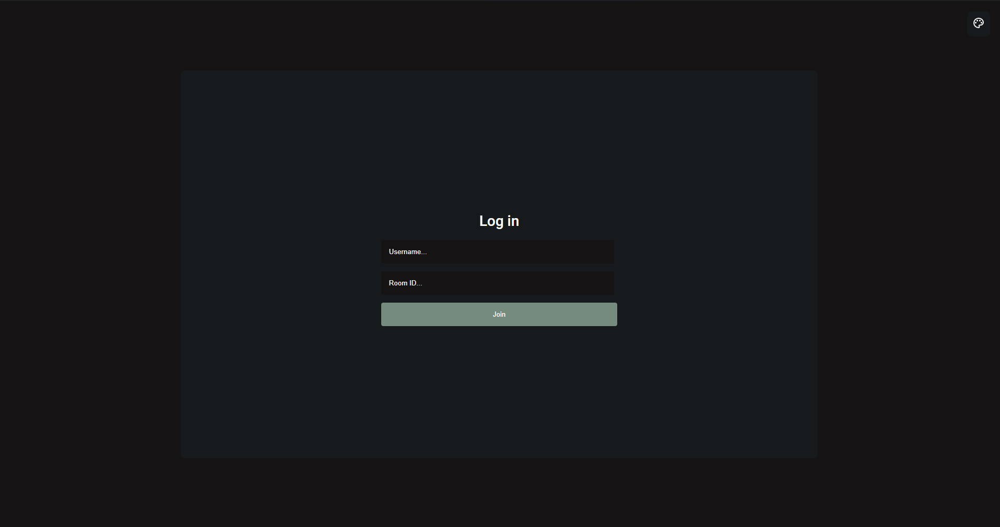

# GhostChat

## About GhostChat

GhostChat is a real-time chat application built with Electron.js, incorporating `Socket.IO`, React, MongoDB, and the Giphy API. It allows users to join or create chat rooms without needing passwords - just a username and room ID. Keep in mind that this app was created as a personal project, which was mainly for learning purposes, so not everything in it is perfect.

## Screenshots

  

  

  

## Features

- **Password-Free Login:** Join anonymous chat rooms with just a username and room ID.
- **Unique Chat Rooms:** Ability to create and join various chat rooms.
- **Real-Time Communication:** Powered by `Socket.IO` for live messaging.
- **Customizable Themes:** Users can create their own themes as well or use the default theme.
- **Giphy Integration:** Send and receive GIFs in chats.

## Tech Stack

- **Frontend:** React
- **Backend:** Node.js, Express.js
- **Real-Time Engine:** `Socket.IO`
- **Database:** MongoDB
- **Additional Libraries:** Electron.js, Giphy API

## Installation

Download the latest release [here](https://github.com/raulsabino/chat/releases/tag/v1.0.0). Currently the app is cross-platform with the ability to run in Windows, Mac, or Linux. To open the application simply unzip the file and find the executable to open.